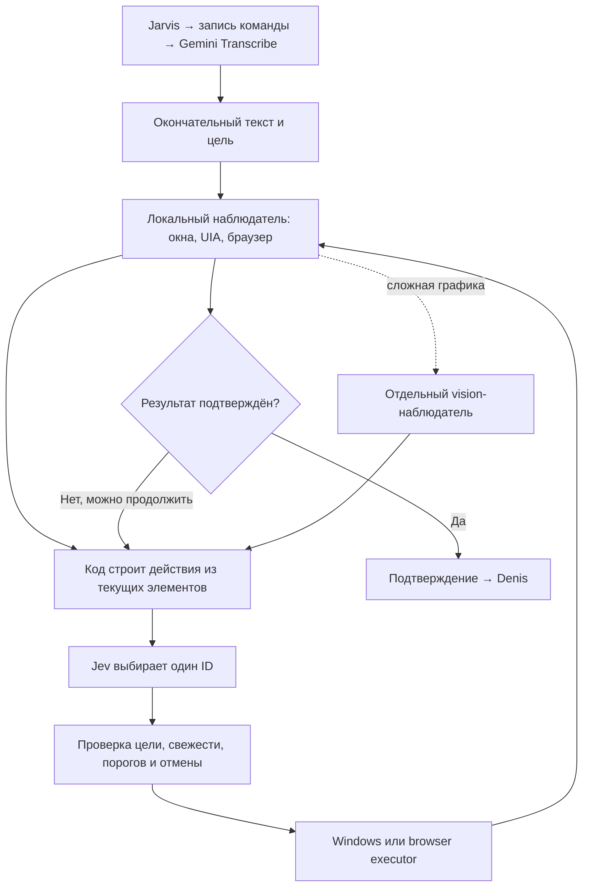

# Самостоятельное управление компьютером: новая схема

20 сентября 2026. Это проект следующего runtime и отдельный проверяемый прототип. Установленное приложение 0.2.0 не обновлялось. Jev — имя модели TypeSafe; Jeff — наше приложение.

## Что означает самостоятельность

Пользователь задаёт цель один раз. Затем приложение само получает состояние, строит варианты действий, запрашивает Jev, выполняет один шаг и проверяет результат. Человек не составляет список кнопок и не выбирает следующий шаг. Доступ к системе предоставляется локальному приложению; облачная модель получает ограниченное текстовое описание, а не прямое подключение к компьютеру.

Узкий эксперимент Chrome/HAPP уже имел такой автоматический цикл: `scripts/test-desktop-jev.mjs` сам наблюдал окна и выполнял два разрешённых действия. В более поздних тестах Музыки и ВК Codex выполнял роли наблюдателя и исполнителя. Обобщать эту ручную часть на все предыдущие тесты было неточно.

## Что реально делают опубликованные проекты

| Проект | Механизм, подтверждённый исходниками | Что переносим |
|---|---|---|
| [browser-use/jev-ultrafast](https://github.com/browser-use/jev-ultrafast) | DOM → наблюдаемые элементы → динамические варианты операции/цели → Jev → CDP → новое наблюдение. Отдельная LLM пишет свободный текст. | Цели создаются из интерфейса, модель не придумывает селекторы. Проверки свежести и видимости перед действием. |
| [awlevin/typesafe-computer-use](https://github.com/awlevin/typesafe-computer-use) | Локальное OCR + macOS Accessibility → пронумерованные элементы → Jev → AXPress или координатное действие. | Постоянный локальный наблюдатель и исполнитель, отдельный writer. Windows-адаптера в этом проекте нет. |
| [achimala/jevinci](https://github.com/achimala/jevinci) | Вопросы о цветах пикселей → вероятности Jev → собственный JS renderer. | Пример композиции решений, не доказательство управления Microsoft Paint. |

Прочитаны [browser model.py](https://github.com/browser-use/jev-ultrafast/blob/main/jev_ultrafast/model.py), [browser.py](https://github.com/browser-use/jev-ultrafast/blob/main/jev_ultrafast/browser.py), desktop [perception.py](https://github.com/awlevin/typesafe-computer-use/blob/main/typesafe_computer_use/perception.py), [decide.py](https://github.com/awlevin/typesafe-computer-use/blob/main/typesafe_computer_use/decide.py), [actions.py](https://github.com/awlevin/typesafe-computer-use/blob/main/typesafe_computer_use/actions.py). Чужие репозитории не запускались.

Тексты [Studio Yebisu](https://x.com/studio_yebisu/status/2101065176069886152) и [Saccc_c](https://x.com/Saccc_c/status/2100833094291087773) получены исследовательским агентом через публичный FxTwitter; прямой X недоступен. Второй пост ссылается в том числе на browser demo Greg. Ролики не просмотрены и рекламные задержки не воспроизведены. Точный ролик с Paint не установлен.

## Предлагаемый runtime Windows



1. **Electron остаётся приложением в трее.** Оно хранит текущую цель, журнал шагов, кнопку остановки и состояние выполнения. Обработка имени остаётся локальной. Запись после имени → пауза конца реплики → Gemini Transcribe → только final запускает задачу. Это целевая схема; установленная 0.2.0 ещё использует AssemblyAI/SAPI.
2. **Локальный Windows helper без Python** предоставляет список мониторов/окон и UI Automation: имя, роль, enabled/offscreen, состояние и доступные действия каждого элемента. Предлагаемый вариант — небольшой .NET/C# sidecar с узким локальным IPC. Jev не получает shell, исходный код или указатели Windows.
3. **Динамические действия.** Для наблюдаемой кнопки с Invoke появляется `invoke(elementId)`, для вкладки с SelectionItem — `select(elementId)`, для окна — `activate(windowId)`. Названия берутся из текущего интерфейса. Фразы «Яндекс Музыка»/«ВКонтакте» не должны быть зашиты в общий генератор.
4. **Надёжный канал для вкладок.** Предлагается расширение браузера с явно включённым доступом: `tabs.query` возвращает id, windowId, index, title, URL; `tabs.update` активирует точный ID. Подключение расширения к Яндекс Браузеру и совместимость нужно отдельно проверить. Альтернатива — UIA там, где браузер его предоставляет. Не подключаемся скрытно через профиль, пароли или debugging port.
5. **Неполный интерфейс.** Когда UIA пусто, локальное OCR даёт текст и прямоугольники; иконки и canvas требуют отдельной визуальной модели. Согласно [официальному State](https://docs.typesafe.ai/concepts/state), Jev сейчас не принимает изображения, аудио или видео. «Дать Jev все скриншоты» не решает эту задачу.
6. **Исполнение и проверка.** Исполнитель повторно находит элемент, сверяет версию наблюдения/окно/идентичность и выполняет ровно одно типизированное действие. Нажатие само по себе не означает успех. Нужны новый activeTabId, состояние воспроизведения, фактическая раскладка или другое наблюдаемое условие. Ответ Jev `done` не заменяет проверку.
7. **Сложные задачи.** Jev выбирает быстрые следующие действия. Для свободного текста и сложного разложения цели используется Gemini; его план остаётся предложением, исполняется тем же проверяемым циклом. Для поддерживаемых простых целей отдельный большой планировщик не требуется.

Не нужно постоянно выгружать весь компьютер в облако. Локальный процесс может постоянно работать, но подробно наблюдает нужное окно во время активной команды и после изменений. В ожидании — локальные события/кеш, без запросов Jev. Скриншоты и содержимое страниц не сохраняются по умолчанию; в API уходит минимальный необходимый текст.

Обзор Antigravity подтвердил необходимость фильтрации большого UIA-дерева, скрытия password-полей, повторной проверки цели и изоляции UIA в sidecar, чтобы зависшее приложение не блокировало Electron. Текущий прототип допускает максимум 32 кандидата; реальный наблюдатель должен сначала выбрать приложение/контейнер и указывать неполноту наблюдения, а не молча отбрасывать остальные элементы. Ограничение прототипа не является пределом API Jev. Операции отправки/покупки/удаления требуют отдельного разрешённого сценария; обычное переключение вкладок не должно спрашивать подтверждение каждого шага.

## Два монитора

Программа перечисляет мониторы и окна на них сразу. Если известно окно Яндекса, выбирать монитор отдельным модельным шагом не обязательно. Для команды «на втором мониторе» координаты/monitorId становятся условием выбора. Для кликов потребуются согласованные физические пиксели, DPI и начало координат виртуального рабочего стола, включая отрицательные координаты. Основной путь — действие по ID элемента; координаты нужны для ограниченного fallback.

Основание: [Electron screen](https://www.electronjs.org/docs/latest/api/screen), [Microsoft UIA tree](https://learn.microsoft.com/en-us/windows/win32/winauto/uiauto-treeoverview), [UIA control patterns](https://learn.microsoft.com/en-us/windows/win32/winauto/uiauto-controlpatternsoverview), [Chrome Tabs API](https://developer.chrome.com/docs/extensions/reference/api/tabs). Это выбор архитектуры, а не заявление о проверенной совместимости всех приложений.

## Прототип в этом изменении

`desktop/automation/observed-task.mjs` реализует общий цикл с внедряемым адаптером. Кандидаты создаются автоматически из `elements[].capabilities`. Сам модуль не читает ОС и не управляет окнами. `scripts/demo-autonomous-jev.mjs` соединяет его с настоящим API Jev и симулятором двух мониторов/браузерных вкладок. Между решениями человек не подготавливает варианты.

```powershell
node --test tests/observed-task.test.mjs tests/ui-choice.test.mjs
node scripts/demo-autonomous-jev.mjs
```

Вторая команда расходует TypeSafe API и пишет `work/autonomous-jev-demo.json`: точные тела запросов и ответы, без Authorization. Режим явно помечен `REAL_API_SIMULATED_DESKTOP`. Это проверка автономного выбора и обновления состояния на симуляторе, не успешное управление реальным Windows/Yandex.

Целевое условие симулятора задано тестовым oracle: активен Яндекс и первая VK-вкладка. Это ещё не универсальное извлечение цели из произвольного русского текста. Нужны реальные адаптеры наблюдения/исполнения и проверка конечных условий; до этого встроить модуль в голосовой цикл было бы преждевременно.

Два фактических прогона с `jev-1.13.0`:

| Версия прототипа | Окно Яндекса | Первая VK-вкладка | Результат |
|---|---|---|---|
| Первый прогон, до привязки ID к поколениям | `a_w17_activate`, P=0,96, confidence=0,95, 941 мс | `a_t32_select`, P=0,90, confidence=0,87, 743 мс | Цель подтверждена за 1706 мс |
| Текущая версия, ID содержат поколение наблюдения | `g1_a_w17_activate`, P=0,97, confidence=0,96, 1099 мс | `g2_a_t32_select`, P=0,83, confidence=0,80, 761 мс | Выбор правильный, но ниже P=0,85: переключение не выполнено, остановка `no_action` за 1905 мс |

Сохраняем оба результата, не повторяем запрос до получения удобного ответа. По двум прогонам нельзя установить причину изменения вероятностей. Первый журнал: `work/autonomous-jev-demo-first.json`; текущий: `work/autonomous-jev-demo.json`. Замеры включают API и операции в памяти, не включают Windows UIA, STT, TTS и запуск/разблокировку ключа. Это не benchmark точности или задержки реального компьютера. При остановке демонстрационный CLI корректно возвращает exit code 1.

После интеграции `npm test`: 76 passed, 0 failed, 1 skipped (существующий Python wake-word oracle). В том числе 13 проверок нового цикла: устаревшая цель, отмена после ответа модели, неизвестный ID, неподтверждённое выполнение, частичный сбой и лимит времени. Возврат A → B → A разрешён в новых поколениях состояния; повтор того же действия в прежнем поколении запрещён. Дополнительный тест сохраняет неуспешную попытку в журнале после успешного fallback.

Порог P ≥ 85%, confidence ≥ 80% сохранён. Это пороги допуска, не доказанная точность 85%. Устаревшее решение отбрасывается, цикл получает новое наблюдение в пределах лимита шагов. Неподтверждённый результат, отмена, неизвестная цель или исчерпанный лимит останавливают задачу; повтор действия после таймаута запрещён. В будущем простой сбой можно исправлять автоматически только после нового достоверного наблюдения и проверки, что действие не было выполнено.

## Следующая реализация и критерий готовности

Порядок: Windows observer/executor → browser adapter → реальные проверки трёх пользовательских команд → подключение final STT и Denis. Полный тест должен выполняться из Assistant Jeff без Codex в цепочке: одна команда, автоматически полученные элементы, самостоятельно выбранные шаги, подтверждённый результат, журнал. Отдельные негативные проверки: пользователь переключил окно во время API-запроса, пропала вкладка, API не ответил, одинаковые названия, второй монитор с другим DPI, кнопка ничего не изменила.

Ограничение Codex Computer Use для текущего Windows-браузера не обходилось. Никакие новые OS/browser адаптеры в этой итерации не запускались.
