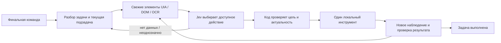

# Восемь постов о Jev: что переносить в Assistant Jeff

Проверено 21 сентября 2026 года. Исходная версия приложения — `0.6.0`, commit `b006b788b9cd909101ce58da0c0b682f02ef131f`. Это исследование источников, сопоставление с текущим кодом и отдельный эксперимент выбора действий. Его результаты не означают, что все предлагаемые возможности уже появились в установленном приложении.

## Главный вывод

**Самостоятельный цикл управления с Jev возможен.** Ему не нужно вручную программировать каждую произнесённую фразу. Программа должна дать модели актуальные элементы интерфейса и допустимые действия; затем повторять наблюдение, выбор, исполнение и проверку. Наиболее близкий открытый пример из присланных материалов — `arc-cua`.

Но ни один из восьми постов не доказывает универсальное управление Windows одним Jev. У демо есть окружающая система: Accessibility/OCR, подготовка данных, набор инструментов, обычный исполнитель, иногда отдельная генеративная модель. Некоторые рекламные цифры относятся к подготовленному фрагменту процесса или к имитации модели.

Для Jeff полезно развивать два уровня: большая модель разбирает свободную команду и формулирует текущую подзадачу; Jev быстро выбирает следующий шаг внутри неё по свежим данным. Когда не хватает наблюдения, инструмента или смысла задачи, управление возвращается большой модели. Это направление развития существующего цикла, а не обязательная установка ещё одного сервиса.

## Покрытие исследования

- Все восемь исходных постов прочитаны во встроенном браузере. Полные длинные тексты получены также через публичное зеркало FxTwitter; основные данные сопоставлены с X syndication.
- Пять исходных видео скачаны для анализа. Четыре не имеют аудиодорожки по `ffprobe`; для них выполнен визуальный разбор. У Burhan выполнена локальная ASR и просмотр кадров. Дополнительно изучена опубликованная автором версия видео Gil повышенного качества.
- Три изображения исходных постов и две картинки цитируемого поста Shann просмотрены.
- Изучены доступные полезные ответы, связанные статьи и исходники. Все комментарии X без входа не показывает; это выборка, не полный архив обсуждений.
- Четыре независимых исследователя разбирали ссылки попарно; отдельный Antigravity/Gemini reviewer проверил архитектуру Jeff. Их рекомендации прошли дополнительную оценку — согласие нескольких агентов не считалось доказательством.
- Внешние торговые/CAPTCHA/desktop проекты не запускались, пользовательские записи не передавались в них. Исследовательские вызовы модели используют только явно синтетические примеры.

## Что находится в каждом посте

| Пост | Что предлагается | Что удалось установить | Значение для Jeff |
|---|---|---|---|
| [Burhan](https://x.com/BurhanUsman/status/2101641842441732297) | Быстрый поиск клипов в длинном видео | ClipFast работает с подготовленными timed transcripts; поиск, оценка и экспорт разделены | Подготовить компактные данные до семантического выбора; измерять каждый этап |
| [Shann](https://x.com/shannholmberg/status/2101751911481573598) | Аудит проектов на задачи для Jev | Методика и prompt, без готового runtime; сравнительная картинка в quoted post помечена как иллюстрация | Сначала одинаковый набор проверенных примеров, затем решение об интеграции |
| [shiv / arc-cua](https://x.com/sxhivs/status/2101729362194432184) | Агент задаёт подзадачу, Jev управляет интерфейсом | Реальный open-source цикл для macOS, структурированные AX/OCR элементы, новые наблюдения после действий | Самый близкий архитектурный референс; нужен Windows adapter и собственная проверка успеха |
| [Gil Feig](https://x.com/GilFeig/status/2101674767266845026) | Английское описание превращается в workflow | Демо Merge Workflow lab; в графе есть отдельный генеративный LLM и инструменты разных сервисов | Компилировать повторяемые последовательности, отделять выбор инструмента от генерации текста |
| [RohOnChain](https://x.com/RohOnChain/status/2101708948990767160) | Быстрый торговый агент | Видео показывает README; опубликованный latency benchmark использует mock с искусственной задержкой | Брать идею короткого цикла и контроля актуальности, не переносить рекламный latency |
| [God of Prompt](https://x.com/godofprompt/status/2101684061190447315) | Skill + аудит дорогих LLM-вызовов | Инструкция разработчику, не автоматическая смена модели Codex | Применить уже установленный TypeSafe skill, найти конкретный узкий вызов |
| [Adam Azzam](https://x.com/AAAzzam/status/2101451692868841664) | Выбирать самую дешёвую способную модель | На картинке разные знаменатели: 56/56, 53/53, 41/60; полного benchmark нет | Проверять итоговую успешность и стоимость всей задачи, включая отказы |
| [Keno](https://x.com/kenonews/status/2101656436136661163) | Массовые дешёвые решения CAPTCHA | В ролике указан демонстрационный ledger; отдельная статья описывает OCR/VLM перед Jev | Полезна схема получения визуальных данных; реальное CAPTCHA-решение не подтверждено |

### Видео: просмотр и транскрибация

Таймкоды ниже приблизительные, кроме отдельно указанных точных кадров. Длительность ролика сама по себе не измеряет время выполнения: подготовка, монтаж и скорость воспроизведения неизвестны.

| Видео | Длительность / звук | Наблюдаемые этапы |
|---|---|---|
| Burhan | 57,4 с, аудио есть | 0–10 с: готовая выдача по AI research, Run Total около $0,0121. 14–26 с: новый поиск и один найденный клип, около $0,0087. 30–46 с: поиск по RL и 16 результатов, около $0,0174. 50–54 с: оценки клипов. Экспорт не показан |
| sxhivs | 11,6 с, без аудио | 0–3 с: передача задачи из терминала; около 6 с: редактор Clock; точный кадр 11 с: карточка 8:00 AM / Wake up / Repeat Never. Дата следующего звонка не показана |
| Gil, включая HQ | 33,4 с, без аудио | 0–8 с: граф GitHub/Linear/Slack → Notion; 12–16 с: Salesforce/Zendesk/Gmail → Google Docs; 20–33,3 с: недельная активность → благодарности в Slack, интерфейс заканчивает на 12/12 |
| Roh | 30,9 с, без аудио | Прокрутка README репозитория. Вызов Jev и исполнение ордеров в видео не демонстрируются |
| Keno | 7,2 с, без аудио | Панели workers и демонстрационный ledger; нет независимо проверяемых ответов внешнего CAPTCHA-сервиса или выплат |

Для Burhan локально получена ASR-транскрипция всего ролика. Она содержит звучащие фрагменты подкаста о данных, AI research и reinforcement learning; отдельного технического рассказа автора о ClipFast в аудио нет. Поэтому полезная для нашей архитектуры информация извлечена прежде всего из экрана и исходников. Для четырёх немых видео вместо выдуманной транскрипции выполнен разбор визуальной последовательности. У Shann, Godofprompt и Azzam исходные медиа — изображения.

### 1. ClipFast: быстрый поиск не равен полной обработке видео

В ролике уже выбран источник длительностью около 1 ч 37 мин. Видны три поисковые выдачи, затем оценки клипов. Загрузки исходника, получения транскрипта и скачивания готовых файлов не показано. Аудио — воспроизводимые отрывки подкаста, а не объяснение архитектуры. Локальный Whisper распознал речь, но местами ошибся в терминах; технические выводы основаны на экране и клиентском коде.

Публичный [app.js](https://clipfast.lol/app.js) отдельно вызывает selection, scoring и export. Локальная ветка требует соответствующий транскрипт с временными метками. [usage.js](https://clipfast.lol/usage.js) складывает оценки стоимости поиска и scoring, не всего процесса. Поэтому формулировку «90 минут → готовые клипы за две секунды и два цента» мы не принимаем как подтверждённый end-to-end результат. Backend и применение FFmpeg не установлены.

Для заметок/истории Jeff аналогичный принцип полезен: обычный поиск формирует небольшой список фрагментов с ID и источником, Jev оценивает смысловую релевантность, код читает оригинальную запись. Выбор ближайшего варианта ещё не доказывает, что подходящий ответ вообще найден.

### 2. Shann и God of Prompt: методика разработки

Оба материала предлагают сначала изучить существующий код и найти повторяемое суждение с ограниченным ответом: выбор, оценка или вероятность. Затем определить данные, последствия ошибки и сравнение с текущим решением. Это разумная постановка эксперимента; инструкции из постов не являются новыми полномочиями для агента.

У [цитируемого Shann поста](https://x.com/shannholmberg/status/2101050494202634537) вторая картинка прямо обозначает времена/расходы LLM как предположения для иллюстрации. Это не измерение нашего приложения. TypeSafe skill уже установлен и прочитан. Он даёт документацию coding agent; сам по себе не заменяет модель Codex и не ускоряет её запросы. [Официальное описание skill](https://docs.typesafe.ai/agent-skill).

### 3. arc-cua: наиболее полезный референс

Исследован [shhivv/arc-cua](https://github.com/shhivv/arc-cua) на commit `57512d47af556efa0d9d8872ede9a1c3adc7e05d`. Python ≥3.12, MIT, реализация ориентирована на macOS. Windows backend в изученной версии отсутствует.

Поток данных: upstream agent задаёт цель, ограничения, разрешённые literal inputs и критерии завершения; Accessibility и Apple Vision OCR превращают локальные наблюдения в элементы; Jev выбирает доступную операцию/цель; исполнитель проверяет допустимость и свежесть; после изменения приложение ждёт стабилизации UI и наблюдает снова. Скриншоты локально делаются — они просто не передаются самому Jev. Модель вызывается на каждом цикле решения. В демо показана короткая задача в приложении Clock, а не произвольный набор Windows-приложений.

Существенная оговорка исходников: optional verification callback есть, но при `verify=None` независимая проверка завершения не выполняется. Сохранённый confidence операции не превращён в порог допуска; ограничения текстом не равны исполнительной политике. Поэтому переносим архитектурное разделение, а собственные guards Jeff сохраняем. Доказательство состояния после действия нельзя заменить словом модели «готово». См. [формирование состояния Jev](https://github.com/shhivv/arc-cua/blob/57512d47af556efa0d9d8872ede9a1c3adc7e05d/src/arc_cua/policies/typesafe.py#L92) и [проверку завершения](https://github.com/shhivv/arc-cua/blob/57512d47af556efa0d9d8872ede9a1c3adc7e05d/src/arc_cua/runtime.py#L119).

Ещё один полезный урок из кода: повтор `StaleDesktopState` внутри execute может обходить проверку лимита повторов, а deadline по умолчанию необязателен. Это статически найденный потенциальный цикл, здесь не воспроизведённый. При адаптации нужен общий счётчик всех попыток и обязательный deadline, включая неудачные действия. [Ветка runtime](https://github.com/shhivv/arc-cua/blob/57512d47af556efa0d9d8872ede9a1c3adc7e05d/src/arc_cua/runtime.py#L244).

### 4. Merge Workflow lab: инструменты и генерация остаются отдельными

Ролик Gil показывает графы с представленными в демо инструментами сервисов; сами подключения независимо не проверены. В кадрах есть узлы API-операций разных сервисов и отдельный генеративный узел `LLM / Summarize`. В конце улучшенной версии интерфейс сообщает `Complete 12/12`; фактический результат в целевом Slack и его качество не показаны. Поэтому результат не означает, что Jev сам пишет свободный текст или автоматически получил доступ к сотням приложений.

Без полного публичного workflow compiler и одинакового benchmark нельзя подтвердить обещания бесплатности, постоянных двух секунд и идентичного результата каждого запуска. Наличие инструмента, его авторизация, входная схема и проверка ответа всё равно обеспечиваются интеграцией. [Пост и обсуждение](https://x.com/GilFeig/status/2101674767266845026).

Для Jeff это направление повторно используемых процедур: например, найти запись → проверить текущие поля → изменить → перечитать. Процедура описывает тип операции, а не одну конкретную фразу пользователя. Произвольные новые задачи продолжают выполняться общим циклом.

В ответах найден [разбор неудачного эксперимента UnCorped](https://x.com/UnCorped/status/2101707226666893553): автор сообщает 9 правильных ответов baseline против 6 с Jev на 20 вопросах, затем 21 против 23 на development-наборе из 50; p=0,6875 не подтверждает убедимого улучшения. Это авторский отчёт, здесь не воспроизведённый. Его полезный урок: лучшее извлечение свидетельств не гарантирует лучшего окончательного ответа. Для Jeff нужно оценивать успешность всей команды после выполнения, а не только качество промежуточного выбора.

### 5. jev-trader: полезно проверить, что именно измеряется

Проверен [репозиторий на b587759](https://github.com/jarrodwatts/jev-trader/tree/b587759e459ea049590102e54a0b07800864cdc3). Его [README](https://github.com/jarrodwatts/jev-trader/blob/b587759e459ea049590102e54a0b07800864cdc3/README.md) относит p50 цикла 100 мс к mock, а [MockModel](https://github.com/jarrodwatts/jev-trader/blob/b587759e459ea049590102e54a0b07800864cdc3/src/model.ts#L79) намеренно ждёт 80 мс. Это не измерение Jev.

В [trader.ts](https://github.com/jarrodwatts/jev-trader/blob/b587759e459ea049590102e54a0b07800864cdc3/src/trader.ts#L85) занятость блокирует обработку новых событий, но после ожидания старого решения нет отдельной проверки возраста перед отправкой. Это статический finding, не результат запуска. Для Jeff вывод конкретный: single-flight и отмена не заменяют повторную проверку target сразу перед действием. В нашем Windows adapter такая проверка уже есть.

### 6. Model router: сравнивать всю задачу

Картинка Azzam не объясняет отсутствующие случаи из заявленных 60. Сравнение ставок за Mtok не равно сравнению денег за успешно выполненную задачу: нужны все входные/выходные токены, дополнительный router, retries, failures и реальные результаты. Найденный [aaazzam/jev](https://github.com/aaazzam/jev) — другая Python/Pydantic обёртка, не воспроизведение таблицы. Она упрощает ответы, теряя probabilities/confidence, что для аудита Jeff не подходит.

В [devos-ing/jevbrain](https://github.com/devos-ing/jevbrain) интересен выбор доступного профиля сабагента с проверкой IDs и возможностью отказа. Его MCP возвращает рекомендацию; workers запускает host. По исследованному коду цены моделей не участвуют в выборе, а опубликованные проверки используют синтетические задачи. Это материал для отдельной задачи «Codex установка», не готовая замена встроенного распределения работ.

### 7. Keno: откуда берётся «зрение»

В CAPTCHA-ролике написано, что расчёты демонстрационные. Публичный код конкретного решения и проверка реального сервиса не найдены. Полезнее связанная статья [How to Give JEV Eyes](https://x.com/kenonews/status/2102037073343422470): сначала извлечь текст/объекты/признаки другим инструментом, затем передать наблюдения Jev. Статья не раскрывает точный pipeline исходного ролика.

Для Windows первый источник — UI Automation, который отдаёт имена, роли, свойства и доступные patterns. Когда этого недостаточно, возможен OCR. [Microsoft UI Automation](https://learn.microsoft.com/en-us/windows/win32/winauto/uiauto-uiautomationoverview), [Windows OcrEngine](https://learn.microsoft.com/en-us/uwp/api/windows.media.ocr.ocrengine). OCR возвращает текст и геометрию; он сам не доказывает, что надпись является кнопкой и что её можно безопасно нажать. Canvas, графики и значки без текста требуют отдельного visual baseline. Прямой Gemini vision нужно сравнить с vision → Jev, чтобы второй вызов не стал лишней задержкой.

## Как сейчас устроен именно наш Jeff

Проверено по исходникам текущей версии, не выведено из постов:

| Слой | Текущее поведение | Что это означает |
|---|---|---|
| Голос | Локальная активация, буфер PCM, Gemini Live, завершение после 2 с тишины; действия только по final | Jev не распознаёт звук и не сокращает задержку самого STT |
| Разбор свободной задачи | `AgentCommands` передаёт Gemini typed tools, результаты и ограниченную историю | Это уже общий многошаговый цикл, не четыре фразы через if/else |
| Выбор Jev | `windows_choose` предлагает следующий ID из текущего наблюдения; порог probability/confidence 0,8 | Сейчас это необязательный инструмент внутри общего цикла, а не самостоятельный быстрый исполнитель подзадачи |
| Windows | UIA/FlaUI, winapp adapter, каталог приложений, текстовые поля и отдельные системные API | Имена/ID берутся из настоящего наблюдения; только наблюдённые поддерживаемые действия доступны модели |
| Заметки/напоминания | Поиск, чтение, создание, изменение, удаление/завершение; свежие expected fields | Операции общие, но качество смыслового поиска и выбора цели нужно отдельно оценивать |
| Проверка | Свежесть target, точные postconditions где доступны; generic invoke требует нового наблюдения | Клик не считается доказательством всей пользовательской цели |

Файлы: `desktop/agent/commands.mjs`, `desktop/agent/windows-tools.mjs`, `desktop/agent/winapp-tools.mjs`, `desktop/agent/text-tools.mjs`, `desktop/agent/data-tools.mjs`, `desktop/providers/windows-choice.mjs`, `server/agent-model.mjs`. Подробный текущий контракт: [agent-system-v06.md](agent-system-v06.md).

Таким образом, в текущей архитектуре 0.6 общий цикл ведёт Gemini, а Jev доступен ему как необязательный советчик по следующему Windows-действию. Просто добавить ещё вызов Jev в такой цикл может увеличить задержку. Чтобы получить пользу схемы arc-cua, короткая подзадача должна проходить несколько шагов без повторного обращения к Gemini после каждого выбора, с возвратом к нему при неоднозначности или отсутствии подходящего инструмента. Именно такой самостоятельный внутренний цикл ещё предстоит реализовать и измерить.

Непонятные английские ID в журналах — ссылки на конкретные наблюдённые действия. Они нужны, чтобы исполнитель не перепутал два похожих окна, но интерфейсу следует показывать рядом обычное название: например, «Свернуть Chrome — Документация», источник наблюдения, причину остановки и отдельный результат проверки. Confidence выбора и подтверждение выполненного действия — разные поля, их не следует объединять в один процент «успеха».

### Где остаются общие ограничения

1. **Покрытие наблюдения.** Модель не выберет кнопку, которую UIA не предоставила. Нужны понятные признаки неполноты, поиск/следующая страница/другой источник данных. OCR/DOM fallback ещё не является универсальной частью нашего Windows исполнителя.
2. **Лишние модельные переходы.** Отдельный вызов `windows_choose` через Gemini сам требует прохода общего цикла. Быстрый Jev не гарантирует быстрое завершение всей команды.
3. **Сложность текущего суждения.** Большой общий запрос с конкурирующими операциями и длинными правилами может ухудшать выбор. Сужение до текущей операции уже поддерживается; нужно проверить, как выбирать и использовать его систематически.
4. **Проверка результата.** После generic invoke не всегда есть точное машинное условие успеха. Семантическая оценка может помогать, но не должна сама предоставлять доказательство эффекта.
5. **Границы приложения и Windows.** Неполное дерево, нестандартный canvas и окно с другими правами — разные причины отказа. Их нельзя устранить снижением confidence или более длинным prompt.

Официальная [карточка Jev](https://docs.typesafe.ai/models) описывает текстовый вход, а [документированные ограничения](https://docs.typesafe.ai/model-jaggedness/jev-1.13) — чувствительность к нерелевантному контексту и сложным формулировкам. [Confidence](https://docs.typesafe.ai/confidence) характеризует распределение ответов, а не даёт гарантию успешного действия Windows.

## Предлагаемое развитие без набора захардкоженных фраз

Возможный контракт подзадачи: `goal`, допустимые операции, конкретное окно, разрешённые literal values, наблюдаемое условие успеха, лимит шагов и deadline. Это предложение, не новый уже установленный API. Например, «найти первую вкладку VK» требует порядка именно вкладок и полного покрытия нужной группы; ссылка VK в содержимом страницы не заменяет вкладку.

Параллельность полезна для независимых вопросов по одному снимку: соответствие кандидатов, наличие нужного состояния, необходимость уточнения. Несколько конкурирующих исполнителей не должны одновременно управлять одним рабочим столом. Если следующий вопрос зависит от результата поиска или клика, ему нужны новые данные, а не параллельный ответ по старому снимку.

Приоритеты:

| Очередь | Изменение | Как проверить |
|---|---|---|
| 1 | Добавить машинные предусловия для выбора по порядку/полноте; сокращение кандидатов само по себе уже проверено и недостаточно | При неполном покрытии нельзя объявлять наблюдаемую вкладку первой среди всех; проверять ложные уверенные решения |
| 2 | Быстрый цикл выполнения одной подзадачи с fallback к общему Gemini циклу | Реальные русские команды на разных приложениях; итоговый успех и весь elapsed, не один HTTP |
| 3 | Отдельное read-only OCR/DOM наблюдение для неполного UIA | Точность/полнота на скриншотах, source IDs, freshness; сначала без кликов по OCR |
| 4 | Смысловой поиск личных записей с явным отсутствием совпадения | Размеченные запросы и ложные совпадения; исходные тексты и ID сохраняются |

Antigravity reviewer предложил объединить наблюдение и Jev-подсказку — это кандидат для измерения. Предложения автоматически объявлять эффект проверенным по Jev и перепривязывать stale action к похожему элементу не приняты: они ослабляют существующие гарантии и не доказаны источниками.

## Эксперимент этого исследования

Выполнены **56 реальных API-запросов Jev 1.13.0**: 14 синтетических русских случаев, два профиля, два повтора, неизменные пороги 0,8. Совпадений с ожидаемым решением — 16/28 у общего набора и 17/28 у ограниченного; медианы вызова — 335,5 и 344,5 мс. Убедительного улучшения от одного сокращения списка не получено. Ошибок HTTP/схемы — 0.

Для «первой вкладки VK» при явно неполном порядке оба профиля уверенно выбрали наблюдаемую первую: все четыре ответа прошли пороги, confidence 0,91–0,95. Это показывает ограничение самого модельного выбора. Статическая проверка текущего Windows-пути также не нашла независимого ordinal/partial-order запрета: неполнота передаётся как текстовое наблюдение, native select проверяет selected state. Реальный ошибочный клик этим экспериментом не воспроизведён; исполнитель не вызывался.

Все числа, каждый случай и пример фактического входа/выхода — в [jev-grounding-evaluation-2026-09-21.md](jev-grounding-evaluation-2026-09-21.md). Набор синтетический: он проверяет локальную гипотезу про состав кандидатов, а не доказывает качество управления реальным рабочим столом, точность голосового ввода или способность модели самой построить правильную подзадачу. В установленный runtime по результатам этого исследовательского запуска изменения не внесены.

## Материалы для «Codex установка»

Все восемь ссылок и отдельный файл передачи отправлены в существующую задачу «Codex установка». Её независимый read-only разбор уже завершён: сначала проверять полноту передачи и результат workers обычным кодом; Jev при необходимости испытывать как советчика по смысловой достаточности контекста. Устанавливать Jevbrain глобально ради обещанной экономии пока не рекомендовано. Это отдельный анализ настроек Codex, не повторная проверка каждого видео.

Переданы prompts аудита Shann/Godofprompt, контракт TypeSafe skill, Jevbrain как selection-only референс и ограничения рекламных benchmark. Skill не требует переустановки. Настройки Codex, его модель, права и реестр других проектов в рамках исследования не менялись.

Для воспроизводимости сохраняются время чтения, версии репозиториев, отдельный список подтверждённых фактов и гипотез. Сырые видео, сторонние тексты и исследовательские JSON остаются вне Git; в репозитории — наш анализ, синтетические примеры и средство проверки.
